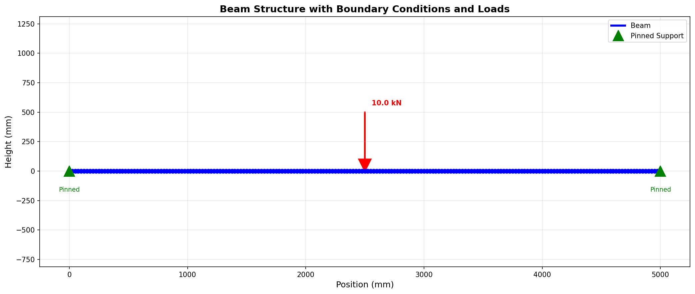
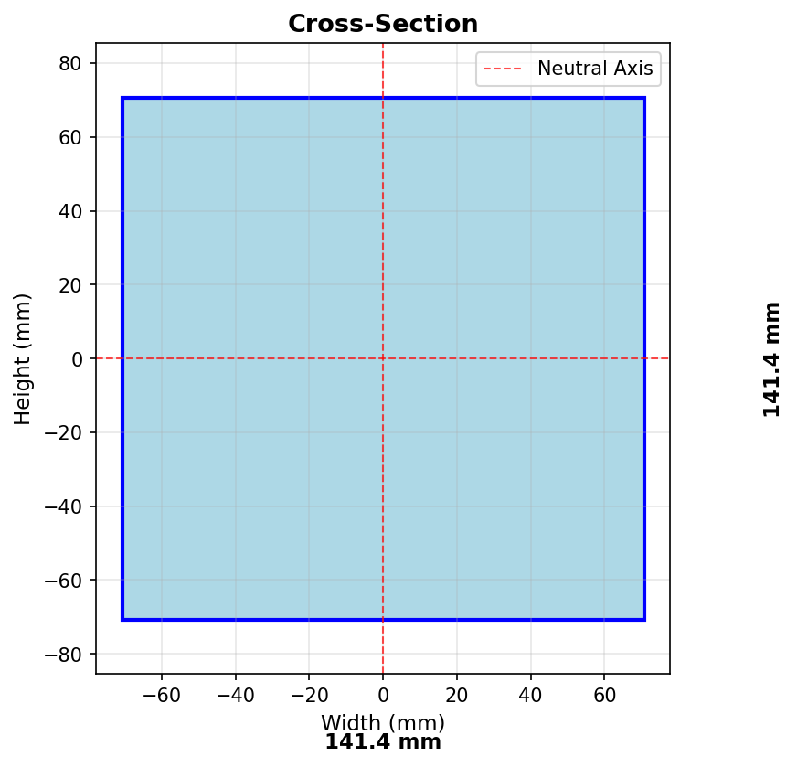
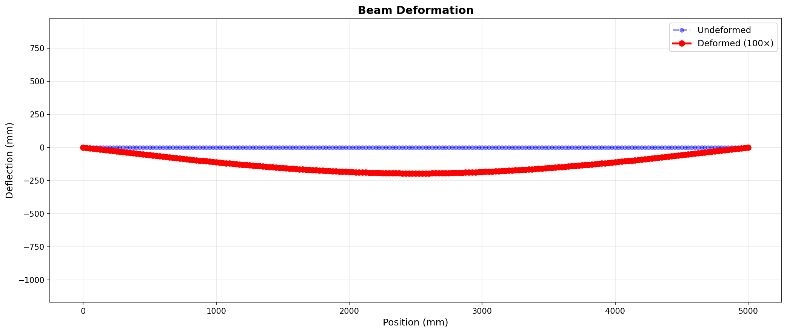
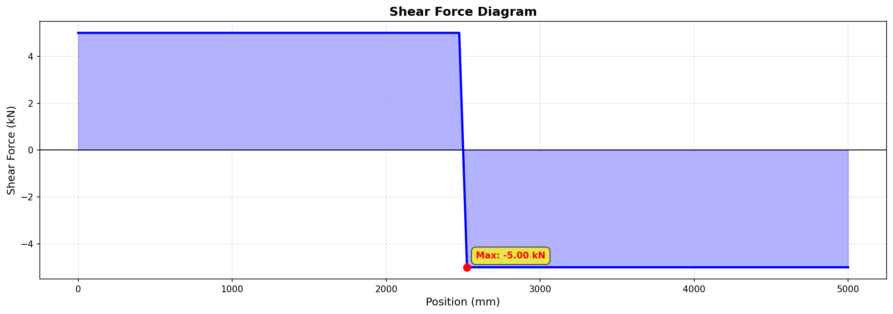
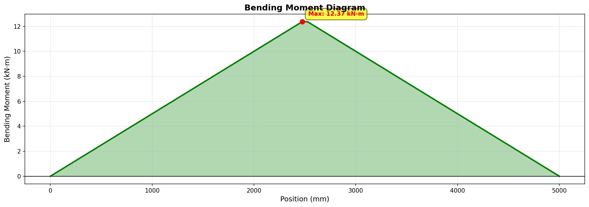

# Beam FEA Analysis Report

**Generated:** 2026-02-08 15:01:34

---

## 1. Analysis Overview

This report presents the results of a finite element analysis of a beam structure subjected to static loading.

### Load Case
- **Name:** Midspan Point Load
- **Number of Point Loads:** 1
- **Number of Distributed Loads:** 0

---

## 2. Model Information

### Mesh Details

| Property | Value |
|----------|-------|
| Number of Nodes | 201 |
| Number of Elements | 200 |
| Total DOFs | 603 |
| Element Type | Euler-Bernoulli Beam |

### Material Properties

| Property | Value | Units |
|----------|-------|-------|
| Material | Steel (Generic Structural) | - |
| Young's Modulus (E) | 200,000 | MPa |
| Shear Modulus (G) | 76,923 | MPa |
| Density (ρ) | 7.85e-06 | kg/mm³ |
| Poisson's Ratio (ν) | 0.300 | - |

### Cross-Section Properties

| Property | Value | Units |
|----------|-------|-------|
| Area (A) | 20,000.00 | mm² |
| Moment of Inertia (Iy) | 6.67e+07 | mm⁴ |
| Moment of Inertia (Iz) | 1.67e+07 | mm⁴ |

---

## 3. Structural Model

### Beam Geometry with Boundary Conditions and Loads

### Cross-Section Details

---

## 4. Analysis Results

### Deformed Shape

The following plot shows the deformed shape of the beam (exaggerated by 100× for visualization):

### Maximum Deflection

| Property | Value |
|----------|-------|
| Maximum Deflection | 1.9531 mm |
| Location | Node 100 (x = 2500.0 mm) |

### Reaction Forces

- **Node 0:** Vertical reaction = 5000.00 N (5.00 kN)
- **Node 200:** Vertical reaction = 5000.00 N (5.00 kN)

### Equilibrium Check

| Property | Value |
|----------|-------|
| Total Vertical Reaction | 10000.00 N (10.00 kN) |
| Total Applied Load | 10000.00 N (10.00 kN) |
| Difference | 1.34e-04 N |

---

## 5. Internal Forces

### Shear Force Diagram

**Maximum Shear Force:** 5.00 kN

### Bending Moment Diagram

**Maximum Bending Moment:** 12.37 kN·m

---

## 6. Summary

The finite element analysis has been successfully completed. Key findings:

- The maximum deflection of **1.9531 mm** occurs at x = 2500.0 mm
- The maximum shear force is **5.00 kN**
- The maximum bending moment is **12.37 kN·m**
- Equilibrium is satisfied with a residual of 1.34e-04 N

---

*Report generated by Beam FEA Analysis Tool*
